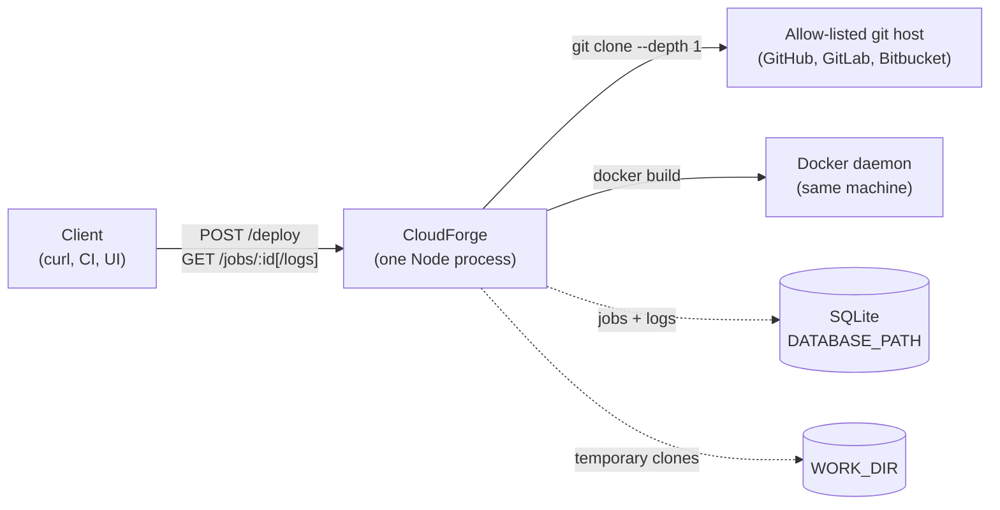
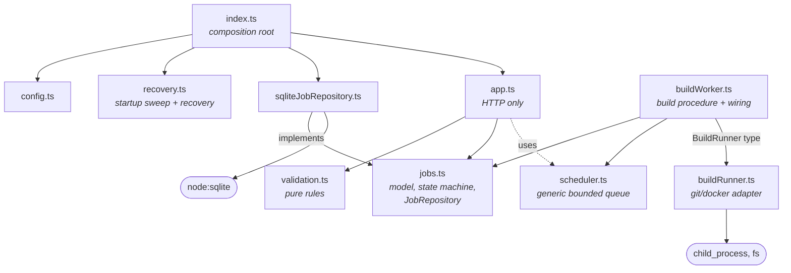
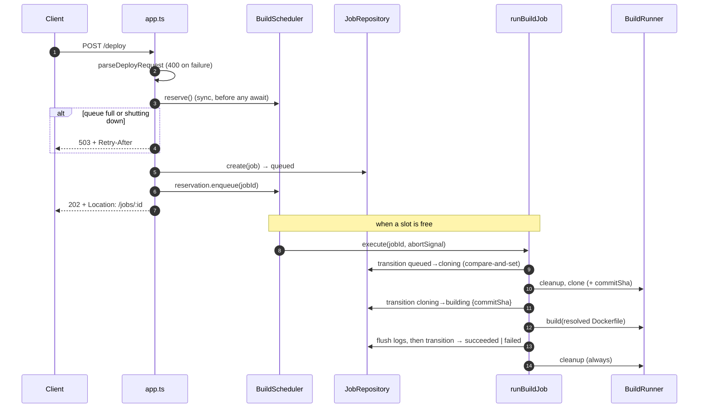
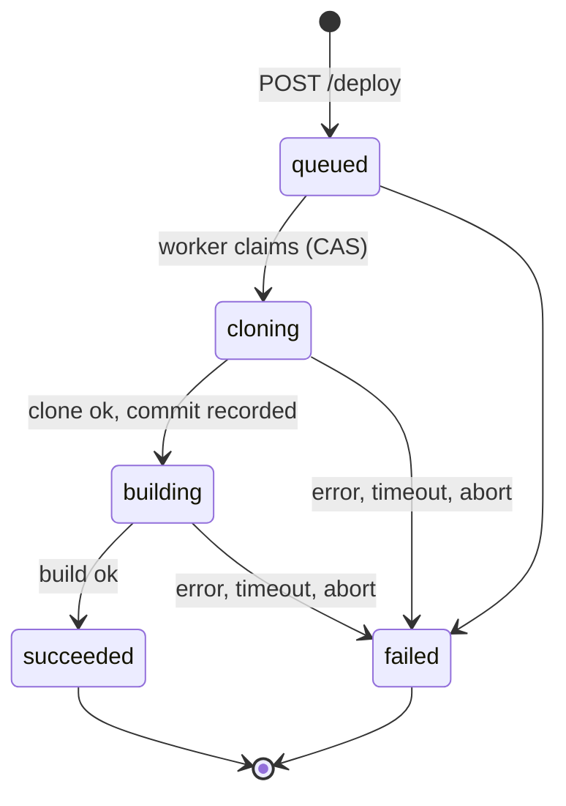

# Architecture

This page explains how CloudForge fits together and *why*. Every structural choice here is a trade-off. The goal is for you to see the trade-off, not just the choice. The significant decisions each have a full record in [`docs/adr/`](adr/README.md). This page links to them rather than repeating them.

## 1. What the system does

A client says "here is a git repo and a path to a Dockerfile". CloudForge queues the request, clones the repo, records the exact commit, runs `docker build`, and reports progress and logs. Deploying the image is the next milestone.



It is still **one process on one machine**, but it is no longer *fragile*: the process can restart without losing jobs, can be overloaded without falling over, and can be stopped without leaving a mess. What it still can't do is run *untrusted* builds or scale past one node. [Section 8](#8-assumptions-and-limits) says exactly where those limits are.

## 2. Module map



| Module | Responsibility | Side effects |
| --- | --- | --- |
| [`index.ts`](../src/index.ts) | Build real dependencies in the right order, recover, listen, shut down | Everything, deliberately in one place |
| [`config.ts`](../src/config.ts) | Environment → typed `Config`; throws on bad values | None |
| [`validation.ts`](../src/validation.ts) | Pure rules for `repoUrl` and `dockerfilePath` | None |
| [`app.ts`](../src/app.ts) | HTTP: parse, reserve capacity, create, respond; one error envelope | None of its own; calls the store and the scheduler |
| [`jobs.ts`](../src/jobs.ts) | `Job` model, **state machine**, `JobRepository` interface, log-cap rule, in-memory implementation | None (in-memory) |
| [`sqliteJobRepository.ts`](../src/sqliteJobRepository.ts) | Durable `JobRepository`: migrations, compare-and-set transitions | Disk |
| [`scheduler.ts`](../src/scheduler.ts) | Run N tasks at once, a bounded FIFO waiting line, reservations, shutdown. **Knows nothing about builds.** | Timers |
| [`buildWorker.ts`](../src/buildWorker.ts) | The build procedure (`runBuildJob`) and the wiring from scheduler to procedure | Through the runner and store |
| [`buildRunner.ts`](../src/buildRunner.ts) | Hardened `git`/`docker` execution: timeouts, abort, minimal env, path containment | Processes, disk |
| [`recovery.ts`](../src/recovery.ts) | Sweep stale clones; fail interrupted jobs; re-queue never-started jobs | Disk, store |
| [`logger.ts`](../src/logger.ts) | JSON-lines event logger, plus a silent one for tests | stdout |

> **Senior lens:** Look at what the three most important modules *don't* import. `jobs.ts` and `scheduler.ts` import nothing from the project at all, and `validation.ts` only `node:path`. They're the policy (what states exist, how much runs at once, what input is legal), and they're the easiest code to test and the hardest to break. The I/O-heavy modules depend on them, never the other way round. [CONTRIBUTING.md](../CONTRIBUTING.md#how-changes-are-expected-to-look) turns this into a rule reviewers enforce.

## 3. Request lifecycle

### `POST /deploy`: validate, reserve, persist, enqueue, respond



Three details carry most of the weight:

1. **Reserve before awaiting.** `reserve()` is synchronous. If the handler checked "is there room?", then `await`ed the database insert, then enqueued, then twenty concurrent requests could all pass the check during the await and overfill the queue. That's a *check-then-act* race, and it happens even in single-threaded Node, because every `await` is a point where other requests run. [ADR-0002](adr/0002-in-process-scheduler.md).
2. **Persist before responding.** The `202` is only sent after the job is in the database. A `202` is a promise, and a restart one millisecond later must not break it.
3. **Claim by compare-and-set.** The worker's first act is `transition(queued → cloning)`. If that returns `false`, someone else owns the job and this run does nothing. That makes `runBuildJob` **idempotent**. [ADR-0004](adr/0004-job-state-machine.md).

### Reading a job

- `GET /jobs/:id` returns the job plus its full (capped) log.
- `GET /jobs/:id/logs?after=N` returns only new chunks. It reads the **status first, then the logs**. The worker stores every line before it sets a terminal status, so "terminal, and fewer chunks than asked for" really does mean done. [ADR-0007](adr/0007-log-storage.md).

### Why state isn't shared by reference any more

The first version handed the same mutable `Job` object to the worker and to request handlers, which was safe only because Node runs one thread and there was one process. Repositories now **return copies**, just as a database does (the contract suite checks this). All changes go through `transition` and `appendLog`. The in-memory store and SQLite store behave the same, and a Postgres store could replace either.

## 4. The job state machine



The table lives in one place ([`jobs.ts`](../src/jobs.ts)) and is enforced by every repository:

- **Illegal** move (not in the table): `IllegalTransitionError`. That's a bug in our code.
- **Stale** move (legal, but the job isn't in `from` any more): returns `false`. That's a lost race, and the caller decides what to do.
- SQLite implements it as `UPDATE … WHERE job_id = ? AND status = ?`, and also has a `CHECK` constraint on `status`.

## 5. Failure model

| Failure | What happens | Where |
| --- | --- | --- |
| Invalid input | `400` with a specific message; nothing is created | `validation.ts` |
| Malformed or oversized body | `400` / `413` in the JSON envelope | error middleware in `app.ts` |
| Queue full / shutting down | `503` + `Retry-After: 30`; nothing is created | `app.ts` + `scheduler.ts` |
| Unexpected exception in a handler | `500 {error:"internal"}`, stack trace logged server-side only | error middleware |
| git/docker missing, daemon down | Job `failed` with a specific message | `runCommand` classification |
| Step runs too long | Child gets `SIGTERM` → `SIGKILL`; job `failed: … timed out after Nms` | `runCommand` |
| Dockerfile missing or symlinked outside the repo | Job `failed` before Docker runs | `resolveInside` |
| Worker itself throws (e.g. store error) | Scheduler's `onError` logs it and tries `failJob`; the scheduler keeps running | `createBuildScheduler` |
| `SIGTERM` | Stop accepting → wait `SHUTDOWN_GRACE_MS` → abort the rest (`failed: … interrupted by shutdown`) → exit 0 | `index.ts`, `scheduler.shutdown` |
| Crash / `SIGKILL` / power loss | On the next start: stale clones swept, in-flight jobs `failed: Interrupted…`, queued jobs resume | `recovery.ts` |

> **Senior lens:** Notice that the last two rows are *different mechanisms for the same goal*. Graceful shutdown is an optimisation. Recovery is the guarantee, because the cases that matter most (OOM kills, power loss) never run your shutdown handler. Design the recovery path first, then add graceful shutdown to make the common case nicer. [ADR-0006](adr/0006-restart-and-shutdown.md).

### Classifying subprocess failures

"The build failed" is useless when the cause is "Docker isn't running". [`runCommand`](../src/buildRunner.ts) turns low-level signals into specific errors:

| Signal | Becomes |
| --- | --- |
| `spawn` `ENOENT` for `docker` / `git` | `DockerUnavailableError("Docker is not installed or not on PATH")` / `Error("Git is not installed…")` |
| Non-zero exit and the **last 4 KB** of output mentions the daemon | `DockerUnavailableError("Docker daemon is unreachable…")` |
| Timer fires | `CommandTimeoutError("<cmd> timed out after Nms")` |
| `AbortSignal` fires | `CommandAbortedError("<cmd> stopped: <reason>")` |
| Anything else non-zero | `Error("<cmd> exited with code N")` (the full command is already in the log) |

The daemon check matches strings in human-readable output. That's pragmatic and tested, but fragile across Docker versions and locales. The structured alternative is the Docker Engine API.

## 6. Data and files

```
.data/cloudforge.db       ← DATABASE_PATH: jobs + job_logs tables (WAL mode)
.work/<jobId>/            ← WORK_DIR: shallow clone, exists only while a job runs
```

- **Schema:** `jobs` (one row per job, `status` checked against the state list, indexed by `(status, created_at)` for recovery) and `job_logs (job_id, seq, text)` (append-only). Migrations are versioned with `PRAGMA user_version`. [ADR-0003](adr/0003-sqlite-job-store.md).
- **Clones:** removed before cloning (a previous attempt may have left one) and in `finally`. On startup, only **UUID-named** directories are swept, so a mistaken `WORK_DIR=$HOME` can't delete your files.
- **Images:** `cloudforge-<full job id>`. That's 122 random bits, so there's no realistic chance of collisions. They're never deleted automatically.

## 7. Configuration and composition

[`index.ts`](../src/index.ts) is the only file that builds real dependencies, and the **order is deliberate**:

1. Load config (fail fast on typos)
2. Open storage, sweep stale clones
3. Build the runner and scheduler
4. **Recover jobs before listening**, so resumed jobs keep their place ahead of new ones
5. Listen
6. On `SIGTERM`: shut down in reverse order

Everything else takes its dependencies as parameters, which is why the tests never need Docker, git, a real port, or a real database file.

## 8. Assumptions and limits

What must stay true for this design to be correct:

1. **Exactly one CloudForge process uses a given database.** Queue order and concurrency limits are in memory ([ADR-0002](adr/0002-in-process-scheduler.md)). Two processes would each run their own limits, although compare-and-set means they'd still never build the same job twice.
2. **The API's callers are trusted.** There's no auth. The default `127.0.0.1` bind makes that likelier to be true (S6).
3. **Builds are trusted.** `RUN` steps execute on the host's Docker daemon with network access (S2). This is the biggest open risk, and it needs a separate project.
4. **Repos are public** and live on allow-listed hosts.
5. **Builds finish within `BUILD_TIMEOUT_MS`**, and the grace period is shorter than the orchestrator's kill timeout.

[Evolving the system](evolving-the-system.md) describes what changes when each assumption stops being true.

## 9. Decisions carried over from the prototype

The prototype recorded its decisions inline on this page. They're kept here with their current status, because *how a decision aged* teaches as much as the decision itself. New decisions go in [`docs/adr/`](adr/README.md).

| Prototype decision | Status | What happened |
| --- | --- | --- |
| **App factory** `createApp(options)` rather than a module-level singleton | Kept | Still why every test builds its own app without opening a port. `createApp` still supplies defaults (in-memory store, default scheduler), so tests stay short; production wiring is explicit in `index.ts`. |
| **In-memory job store** behind a small class | Superseded by [ADR-0003](adr/0003-sqlite-job-store.md) | The class boundary paid off. Callers already went through methods, never the `Map`, so the store became an interface with two implementations. |
| **Fire-and-forget worker** (`void runBuildJob(...)`) | Superseded by [ADR-0002](adr/0002-in-process-scheduler.md) | Fine for a demo. It had no concurrency limit and no backpressure, so it was replaced by a bounded scheduler. |
| **Shell out to the `git`/`docker` CLIs** with an argv array | Kept, hardened by [ADR-0001](adr/0001-security-defaults.md) | Still no shell and no injection. Now also a minimal environment, closed stdin, timeouts, and abort. String-matching daemon errors remain a known weakness. |
| **Shallow clone** (`--depth 1`) | Kept, improved | Builds now record `commitSha`, so you always know what was built. There's still no way to *choose* a ref (R7). |
| **Polling for the full log** | Superseded by [ADR-0007](adr/0007-log-storage.md) | `GET /jobs/:id/logs?after=` returns only new chunks, and `GET /jobs/:id` still returns everything for simple clients. |
| **`node:test`** instead of Jest or Vitest | Kept | No framework dependency, and it pushed the codebase towards hand-written fakes, which the contract suite now keeps honest. |
