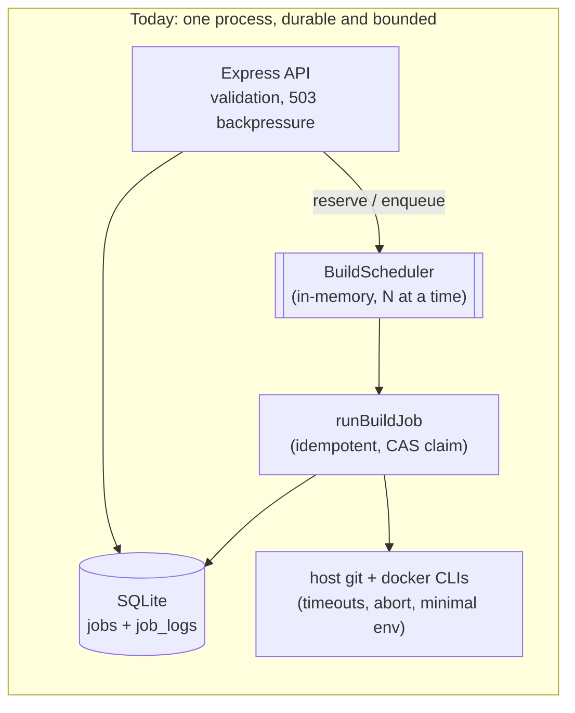
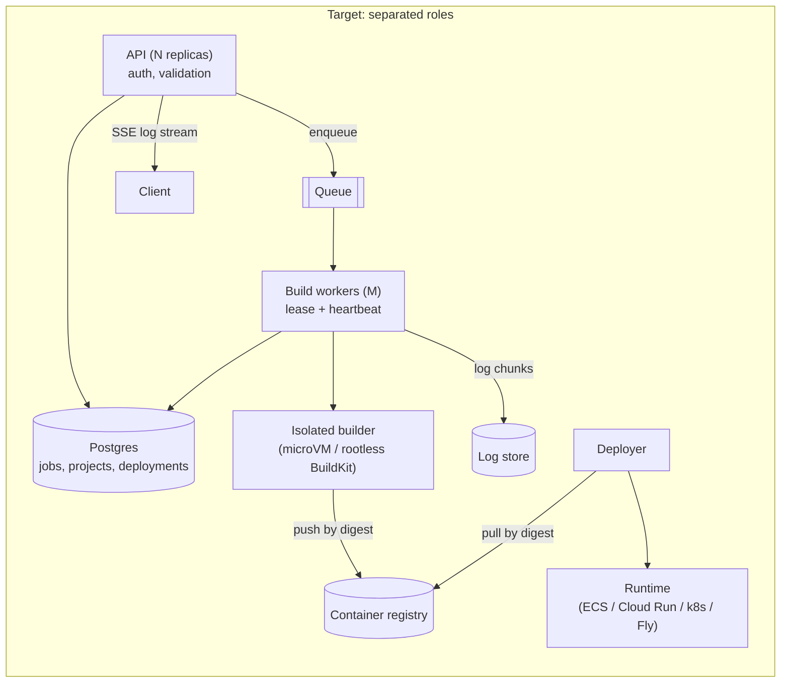
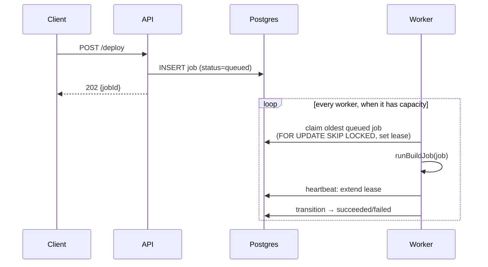

# Evolving the System

The README roadmap lists the milestones: **Build worker** (done), **Reliable single node** (done), **Deploy target**, **Auth + projects**, and **Isolated builders**. This page is about *how* to get there. The aim is to evolve the current design in small, safe steps rather than rewrite it, and to be clear about the trade-offs at each step.

The central lesson: **the seams that make CloudForge testable today are the same ones that let it grow.** `JobStore`, `BuildRunner`, and `runBuildJob` were kept free of HTTP and free of each other's internals, so each can be replaced independently. The "reliable single node" milestone proved this: the store became an interface with a SQLite implementation, and a scheduler went in front of the worker, **without changing `BuildRunner` beyond adding cancellation and the commit SHA**.

> **Progress:** Step 1 is ✅ done (SQLite; Postgres is the next implementation). Step 2 is 🟡 half done: there's a bounded in-process queue with backpressure, and the worker is idempotent and claims jobs by compare-and-set, but there's no cross-process queue yet. Step 6 is 🟡 half done: incremental log reads, but no push. Each step below says what's left.

## Where we are vs where we're going





Every box on the right exists because of a problem listed in the [production readiness review](production-readiness.md). You don't need all of it at once. The steps below are ordered so that each one ships value on its own.

---

## Step 1: Make the store an interface, then make it durable

> **Status: ✅ done** ([ADR-0003](adr/0003-sqlite-job-store.md), [ADR-0004](adr/0004-job-state-machine.md)). Implemented as described below: an async `JobRepository`, `transition(from, to)` with compare-and-set, logs as sequenced chunks, and one contract suite for both implementations. **Left:** a `PostgresJobRepository` that passes the same contract suite, when a second process is needed.

**Problem solved:** R4 (lost on restart) and R3 (unbounded memory). It also makes multiple processes possible.

`JobStore` is a class, but callers only use five methods. Pull those out as an interface:

```ts
export interface JobRepository {
  create(input: NewJob): Promise<Job>;
  get(jobId: string): Promise<Job | undefined>;
  transition(jobId: string, from: JobStatus, to: JobStatus): Promise<boolean>;
  appendLog(jobId: string, chunk: string): Promise<void>;
  fail(jobId: string, error: string): Promise<void>;
}
```

Three deliberate changes:

1. **Methods become `async`.** A database call is async, so the interface has to be too. This is the biggest ripple through the code, so do it *first*, while the implementation is still the in-memory one and the tests stay fast.
2. **`setStatus` becomes `transition(from, to)`,** which returns whether it applied. This enforces the state machine (R8) and becomes a *compare-and-set* once there's a database: `UPDATE … WHERE status = $from`. That is what makes it safe for two workers to race.
3. **Logs are no longer a field on `Job`.** Store them as ordered chunks (`job_logs(job_id, seq, chunk)`) or in object storage. The job row stays small, and `?since=seq` pagination comes for free (implemented as `?after=<seq>`).

Then add `PostgresJobRepository` (or SQLite for single-node). Keep the in-memory one for tests. **Run the same test suite against both implementations** (a *contract test*) so they can't drift.

> **Senior lens:** Changing an interface's *shape* (sync to async) and changing its *implementation* (Map to Postgres) at the same time is how migrations go wrong. Change the shape first with the old implementation, ship it, then swap the implementation.

## Step 2: Put a queue between "accept" and "do"

> **Status: 🟡 half done** ([ADR-0002](adr/0002-in-process-scheduler.md)). There's an in-process bounded queue with `503` backpressure, the worker is idempotent, and it cleans before cloning, so it's already safe to put behind an at-least-once queue. **Left:** the cross-process part (Postgres `SKIP LOCKED` claims, leases and heartbeats, a reaper for expired leases). Startup recovery ([ADR-0006](adr/0006-restart-and-shutdown.md)) is the single-node version of the reaper.

**Problem solved:** R2 (unbounded concurrency), and it lets API and worker scale separately.

Today `POST /deploy` *calls* the worker. Instead, it should *record intent* and let workers *pull*:



**Choosing the queue:**

| Option | Good when | Watch out for |
| --- | --- | --- |
| **Postgres table + `SELECT … FOR UPDATE SKIP LOCKED`** | You already have Postgres; up to hundreds of jobs per second | Polling load; you write lease logic yourself |
| **Redis + BullMQ** | You want retries, delays, and a dashboard out of the box | Another stateful service; Redis persistence settings matter |
| **Managed (SQS, Cloud Tasks, Pub/Sub)** | You're on that cloud and want zero ops | Visibility timeouts, at-least-once delivery, vendor lock-in |

For this project, the Postgres-as-queue option is the best teaching choice and a legitimate production one. The job row *is* the queue entry, so there's no second system that can disagree with the database.

**Concepts you must handle whichever you pick:**

- **At-least-once delivery.** A worker can crash after building but before recording success, so the job *will* run again. `runBuildJob` must be **idempotent**: same job id, same tag, a clean work dir (`cleanup` before `clone`, not only after).
- **Leases and heartbeats.** A claimed job has a `lease_expires_at`, and a healthy worker keeps extending it. A reaper returns jobs with expired leases to `queued`, up to a max-attempts limit, after which they're `failed`. This fixes "stuck in `building` forever" for good.
- **Backpressure.** Workers pull only when they have capacity, so concurrency is bounded by `M × slots` no matter how fast requests arrive.
- **Transactional outbox.** If creating a job and enqueuing it are two writes to two systems (DB plus SQS), one can succeed without the other. Either use the DB as the queue or write an `outbox` row in the same transaction and relay it. You'll meet this problem in every event-driven system.

`runBuildJob` barely changes. It's already a function of `(job, store, runner, workDir)`. That's the payoff from ADR-3's decision to keep it free of HTTP.

## Step 3: Isolate the builder

**Problem solved:** S2 (untrusted code on the host) and S5 (inherited credentials).

`BuildRunner` is the seam. Write a new implementation; the worker doesn't change.

| Approach | Isolation | Cost and complexity |
| --- | --- | --- |
| Host `docker build` (today) | None: shared daemon, effectively root | Lowest |
| Rootless BuildKit / Buildah in an unprivileged container | Namespaces and user namespaces; no root daemon | Medium |
| Kaniko in a Kubernetes pod | Container-level; no daemon at all | Medium; needs k8s |
| Ephemeral microVM per build (Firecracker, Kata, gVisor) | Kernel-level; the industry standard for multi-tenant | Highest; this is what large hosted CI/build services use |

Whichever you choose, also: deny egress by default (allow the git host and package registries only), set CPU, memory, disk, and time quotas per build, never share a layer cache across tenants, and give the builder only the credentials for *this* job.

This is also why the root `Dockerfile` doesn't package CloudForge itself. A containerised CloudForge that runs builds needs the Docker socket mounted, which hands it root on the host. Separating the API (which needs no special privileges) from the builder (which needs to be isolated) is the real fix.

## Step 4: Ship the image (the "Deploy target" milestone)

The build ends with a local tag. Deploying adds two stages:

1. **Push to a registry** (ECR, GHCR, Artifact Registry). Record the **digest** that comes back (`sha256:…`). Tags are mutable pointers and digests are immutable content addresses. **Always deploy by digest**, so you know exactly what's running and rollbacks are exact.
2. **Update a runtime** to run that digest. Start with one target behind an interface, mirroring `BuildRunner`:

```ts
export interface DeployTarget {
  deploy(input: { imageDigest: string; service: string; env: Record<string, string> }, log: LogSink): Promise<{ url: string }>;
}
```

Model the result as a new entity, not more job statuses:

```mermaid
erDiagram
    PROJECT ||--o{ BUILD : has
    PROJECT ||--o{ DEPLOYMENT : has
    BUILD ||--o| DEPLOYMENT : "produces image for"
    PROJECT { uuid id; string repoUrl; string dockerfilePath }
    BUILD { uuid id; string commitSha; string imageDigest; string status }
    DEPLOYMENT { uuid id; string imageDigest; string status; string url }
```

> **Senior lens:** Resist stretching `JobStatus` to `… | "pushing" | "deploying" | "live"`. A build and a deployment have different lifecycles: one build can be deployed many times (redeploy, rollback, promote to production). When a status enum starts describing two things, it's really two entities.

## Step 5: Auth and projects

- **Projects** own configuration (`repoUrl`, `dockerfilePath`, env vars, target). `POST /projects/:id/builds` replaces free-form `POST /deploy`, which also closes most of the SSRF and path-injection surface, because inputs are set once by an authorised owner and can be validated then.
- **API keys:** store only a hash (e.g. SHA-256 of a high-entropy key), show the key once, scope it to a project, and support revocation.
- **Authorization on every read:** `GET /jobs/:id` checks the caller owns the job's project. Return `404`, not `403`, for other people's jobs so ids can't be probed.
- **Private repos:** use a GitHub App installation token minted per build with the least scope needed. Never user tokens in URLs, and never the operator's credentials (S5).
- **Idempotency keys:** accept an `Idempotency-Key` header on `POST`, so a client retrying after a timeout doesn't start two builds.

## Step 6: Stream logs instead of polling

> **Status: 🟡 half done** ([ADR-0007](adr/0007-log-storage.md)). `GET /jobs/:id/logs?after=<seq>` exists. **Left:** Server-Sent Events, using `seq` as the event id.

Replace full-log polling with:

- `GET /jobs/:id/logs?after=<seq>`, which returns new chunks plus the next cursor (implemented). It's cheap, cacheable, and works with `curl`.
- `GET /jobs/:id/logs/stream` using **Server-Sent Events**, which is one-way, runs over plain HTTP, and reconnects automatically with `Last-Event-ID`, so it maps exactly onto `seq`. For one-way log streaming, WebSockets are usually more machinery than you need.

---

## Order of operations and why

| Step | Unblocks | Risk if skipped |
| --- | --- | --- |
| 1. Durable store | Multi-process, restarts | Everything else builds on sand |
| 2. Queue | Horizontal scale, backpressure | Overload takes the whole service down |
| 3. Isolation | Untrusted users | Host compromise |
| 4. Deploy target | The product's actual promise | — |
| 5. Auth + projects | Multi-tenant | Anyone can use your compute |
| 6. Log streaming | UX, efficiency | Wasted bandwidth |

Steps 3 and 5 must be done **before** exposing CloudForge to anyone you don't trust, even though the roadmap lists "Deploy target" first. Feature order and risk order are different lists, and a senior engineer keeps both in mind.

## Design review questions to practise

Answer these before building each step. There's no single right answer; the point is to have *a* reasoned answer.

1. What happens to a build in progress when you deploy a new version of the worker?
2. A user pushes twice in 5 seconds. Should the first build be cancelled, kept, or both deployed in order?
3. The registry push succeeds but recording the digest in the DB fails. What state is the system in, and how does it recover?
4. How would you know, from dashboards alone, that builds have started failing because Docker Hub is rate-limiting you?
5. What is the most expensive thing a malicious *authenticated* user could make you pay for, and what caps it?
