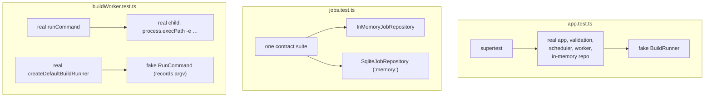

# Testing

CloudForge has about 130 tests that run in a couple of seconds, and **none of them needs git, Docker, a network port, or a database file**. That's not luck. The code was shaped so its behaviour can be checked without its side effects. This page explains how, and where the suite is still thinner than it looks.

```bash
pnpm check
```

That runs type-check → test → build, the same gates as [CI](../.github/workflows/ci.yml). The type-check covers **test files too**. `tsx` strips types without checking them, so before this gate existed a test could pass while being badly typed. When the `BuildRunner` interface changed, the type-check pointed straight at every fake that no longer matched.

## The test files

| File | Tests | Level |
| --- | --- | --- |
| [`jobs.test.ts`](../src/jobs.test.ts) | State machine table, log-cap rule, **repository contract suite** (run twice), SQLite persistence | Unit + contract |
| [`scheduler.test.ts`](../src/scheduler.test.ts) | Concurrency, FIFO, reservations, backpressure, shutdown and abort | Unit (deterministic concurrency) |
| [`buildWorker.test.ts`](../src/buildWorker.test.ts) | Build procedure, idempotency, abort, log flushing; runner argv, env, and path checks; real child processes | Unit + real processes |
| [`recovery.test.ts`](../src/recovery.test.ts) | Startup sweep safety; fail-in-flight and re-queue policy | Unit + real filesystem |
| [`validation.test.ts`](../src/validation.test.ts) | Input rules as tables; config parsing | Unit (pure) |
| [`app.test.ts`](../src/app.test.ts) | The HTTP contract: statuses, error envelope, `503`, logs pagination, readiness | Component (real app, fake runner) |

Shared helpers live in [`testSupport.ts`](../src/testSupport.ts), which is excluded from the build.

## Strategy: swap as little as possible, as low as possible



| Seam | Faked where | Lets you test |
| --- | --- | --- |
| `JobRepository` | Everywhere except the contract suite | Worker and HTTP behaviour against the in-memory store, which the contract suite proves matches SQLite |
| `BuildRunner` | App, worker, recovery | The whole job lifecycle without git or Docker |
| `RunCommand` | Runner tests | The **exact argv, env, and timeouts** passed to git and docker |
| `Execute` | Scheduler tests | Concurrency behaviour with plain promises |
| `ReadinessCheck` | App tests | `/ready` turning `503` without a real Docker outage |
| `Logger` | All (silent by default) | Quiet test output |

> **Senior lens:** These are *fakes* (small working implementations), not *mocks* (objects you assert calls against). Fakes let you test **outcomes** ("the job ended `failed` with this error") rather than **interactions** ("`fail` was called once"). Outcome tests survive refactoring. Record calls only when the call itself *is* the behaviour, as with the git argv.

## Technique 1: the contract suite

A fake is only useful if it behaves like the real thing. [`repositoryContract(name, make)`](../src/jobs.test.ts) is a function that *defines* tests, and it's called once per implementation:

```ts
repositoryContract("InMemoryJobRepository", (max) => new InMemoryJobRepository({ maxLogBytes: max }));
repositoryContract("SqliteJobRepository", (max) => new SqliteJobRepository(":memory:", { maxLogBytes: max }));
```

It pins down behaviour that's easy to get subtly different between implementations: compare-and-set semantics, illegal-transition errors, **returning copies** (mutating a returned job must not change the store), log ordering, pagination cursors, truncation, oldest-first listing.

**Rule:** a new `JobRepository` (e.g. Postgres) isn't done until it's added to this list and passes.

## Technique 2: deterministic concurrency

Concurrency tests that rely on `sleep` are slow and flaky. These tests control *when* each task finishes instead:

```ts
const gate = deferred();                      // a promise you resolve from outside
execute = (id) => { started.push(id); return gate.promise; };
// ... enqueue four tasks ...
assert.deepEqual(started, ["a", "b"]);        // exactly `concurrency` started
gate.resolve();                               // finish one, on our schedule
```

The scheduler tests use this to prove, with no timing dependence, that:
- at most `concurrency` tasks run, in FIFO order
- **unused reservations count against the limit**, which is the check-then-act protection
- shutdown waits for running tasks but starts no new ones
- tasks still running after the grace period get an aborted `AbortSignal`

## Technique 3: race conditions as tests

- **Lost claim:** the job is moved to `cloning` *before* `runBuildJob` runs, and the test asserts the worker does nothing. That's the idempotency guarantee (ADR-0004).
- **Log flush ordering:** a wrapper repository makes `appendLog` slow, with decreasing delays so unserialised writes would land out of order. It records the log *at the moment* the job becomes `succeeded`, and asserts every line was already there. Without the worker's serialise-and-flush, this test fails.
- **Queue overfill:** `app.test.ts` fills a queue with `maxQueued: 1`, asserts the third request gets `503 Retry-After: 30`, then drains it and asserts capacity comes back.

## Technique 4: real processes, cheaply

Behaviour that depends on the OS gets tested against real child processes, using **`process.execPath`**, the Node binary running the tests, with a one-line script. It exists on every machine and in CI:

| Script | Proves |
| --- | --- |
| `setTimeout(() => {}, 60_000)` + `timeoutMs: 100` | Timeouts kill the child and reject with `CommandTimeoutError` |
| same + an `AbortController` | Abort kills the child and rejects with `CommandAbortedError` |
| `process.stdin.pipe(process.stdout)` | The child gets EOF on stdin at once (the `docker build -f -` hang can't happen) |
| `docker` with `env: { PATH: "/var/empty…" }` | `ENOENT` is mapped to a clear error. This passes `env` as a parameter instead of mutating `process.env`, so there's no global state to restore. |

Real *filesystem* behaviour (symlink escapes, `realpath`, sweep safety, SQLite reopen) is tested with `mkdtemp` directories, and every test removes them in `finally`.

## Verified outside the suite

Some behaviour can't be unit-tested honestly, so it was checked by hand against a live server with real git, real Docker, and a SQLite file on disk. The steps are here so you can repeat them:

| Scenario | Result |
| --- | --- |
| `MAX_CONCURRENT_BUILDS=1 MAX_QUEUED_BUILDS=1`, three `POST`s | Third gets `503` + `Retry-After: 30` |
| `/ready` with Docker running | All three checks `ok` |
| `SIGTERM` mid-clone, `SHUTDOWN_GRACE_MS=0` | Exit 0; job `failed: git stopped: interrupted by shutdown`; queued job stays queued |
| `SIGTERM` mid-clone, `SHUTDOWN_GRACE_MS=60000` | The running build finishes (`succeeded`), then exit 0; the queued job doesn't start |
| Restart after either | Queued job resumes and builds the commit GitHub reports as `HEAD` |
| `SIGTERM` via the shell's `kill` in the sandboxed dev environment | The handler **didn't run** (exit 143), because `$!` there is a wrapper, not Node. Signal tests must send the signal to the Node PID directly, e.g. from a harness that `spawn`s the server. |

That last row is a real lesson: **when a test result surprises you, check the harness before you debug the code.**

## Known gaps

1. **No automated test runs real git and Docker.** Add one gated on an environment variable ([exercise 10](exercises.md#10-an-opt-in-integration-test)) and run it in a scheduled CI job, not on every PR.
2. **`index.ts` isn't covered by automated tests.** It's wiring, and it was verified by the manual scenarios above. A small harness test that spawns the server and sends `SIGTERM` would lock that in.
3. **No load test.** The concurrency limits are proven correct, not proven *well-tuned*.
4. **The `docker` abort is only proven at the CLI level.** Whether the daemon also stops the build is unverified (ADR-0006).

## Writing new tests: checklist

- [ ] New repository? Add it to `repositoryContract`.
- [ ] New async ordering or concurrency rule? Prove it with `deferred()` gates, not sleeps.
- [ ] Waiting for a state? Use `waitFor(check, description)`, which fails with a clear message instead of hanging.
- [ ] New subprocess behaviour? Test it with `process.execPath`, and inject `env` rather than mutating `process.env`.
- [ ] New failure mode? Assert the job's `status`, `error`, and logs, **and** that cleanup ran.
- [ ] Temp files? `mkdtemp` + `rm` in `finally`.
